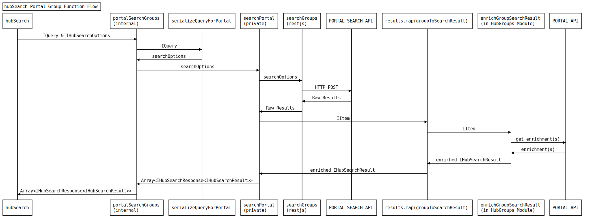

# Hub Search Internals

`hubSearch` is the main search function for hub.js. This replaces all previous search implementations and unifies searching for Items, Groups and Users, as well as handling enrichments, and conversion into `IHubSearchResult` objects. All three of these "entity types" use the same `FilterGroup` based query structure, which can then be serilized and executed against either the Portal API or the Hub Api.

**Note** in the future, `hubSearch` will support Events, Posts, and (likely) Telemetry

## Determining the API and Entity Type

As depicted in the sequence diagrams below, the flow is complex, and has many points where we need to apply type specific logic - thus there is a lot of delegation.

The first decision point is to decide what function to call to start the execution. This breaks down into determining the entity type being requested (Item/Group/User), and the API to use (`arcgis` vs `arcgis-hub`).

From that point forward the functions are specific to the entity type and the api.

These second level functions are all `internal` and thus can not be accessed outside of the `hub-common` package.

All of these functions utilize the same utility functions to serialize the `IFilterGroup<FilterType>[]` into the necessary structure for the target API.

## Enrichment

While this is mainly focused on Items, the other entity types will also support enrichments over time, so they utilize the same function chains. Essentially, after the initial search results return from the API, the `include` array is used to determine the additional "enrichments" that need to be fetched. For items, this is done in the `enrich{Type}SearchResult` functions, implemented in the `HubContent`, `HubSite`, `HubPage`, and `HubProject` modules, where furter type-specific logic can also be applied, including the concept of "default enrichments", which are always applied for that type. The actual enrichments are fetched using the `fetchItemEnrichments` function, used internally by `fetchContent`. For Groups, `fetchGroupEnrichments` is called.

Once the enrichments are fetched, the `include` array is used to determine if the whole object is attached, or if we are just plucking out a deep object path, and then attaching that into the `IHubSearchResult` object.
Once that's all done, the `IHubSearchResponse<IHubSearchResult>` is returned to the caller.

## Item Search Sequence Diagram

## Group Search Sequence Diagram

## User Search Sequence Diagram

- user search not implemented yet
